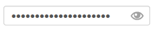
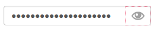
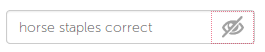

# Password toggle

Widget to simplify forms by using a single input for password with visibility toggle. 

## Preview

## Usage

1. Import the `SCSS` in your main stylesheet (or link to the `CSS`): 

        @import "password-toggle";
        
2. add the `HTML` code from [./password-toggle.html](./password-toggle.html) to your form ;

3. add the `JS` to your page or your `gulp` :

        

4. Enjoy!